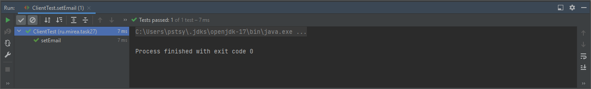
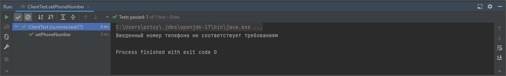

В предыдущем задании были протестированы методы добавление и получения номера/адреса электронной
почты при помощи модуля JUnit. По результатам тестирования ошибок выявлено не было, код можно передавать для
использования в финальной сборке проекта. Скриншоты тестов

